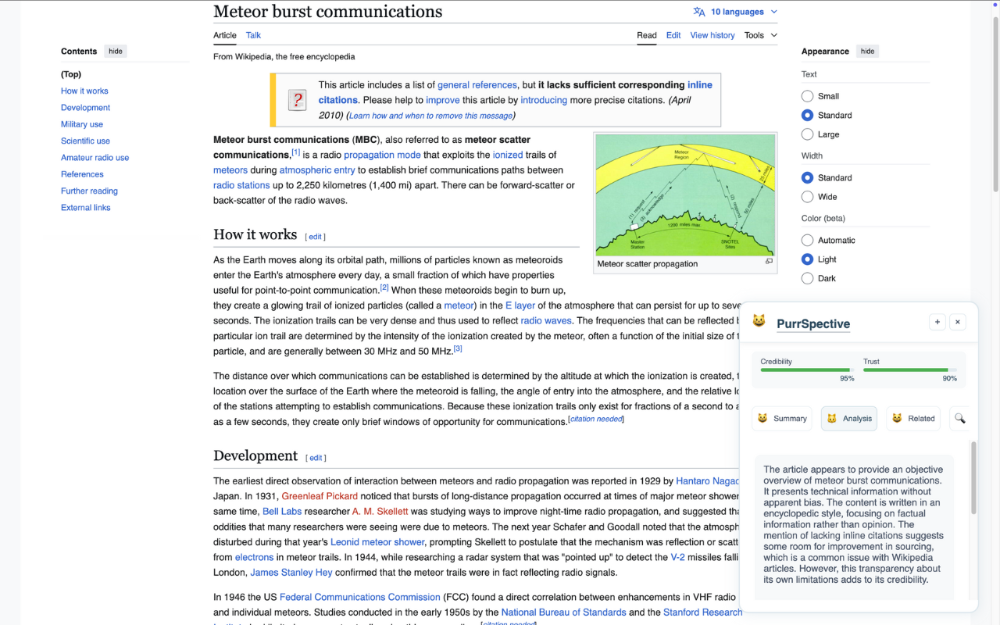
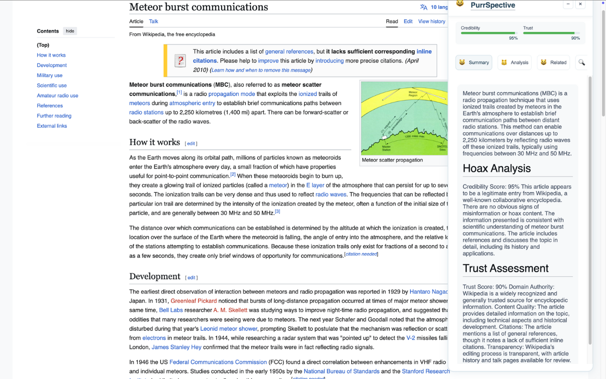
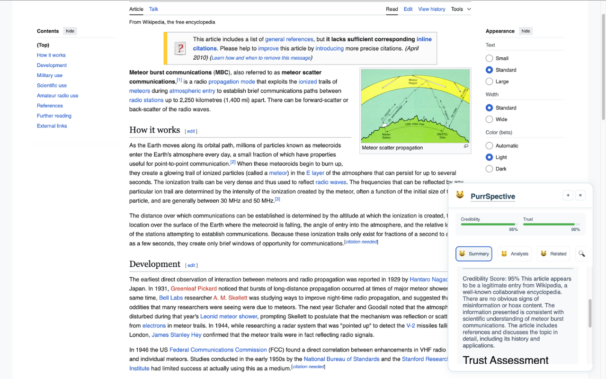
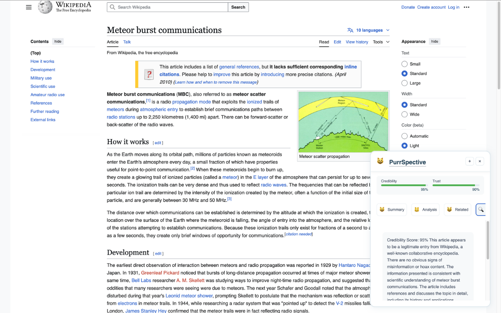
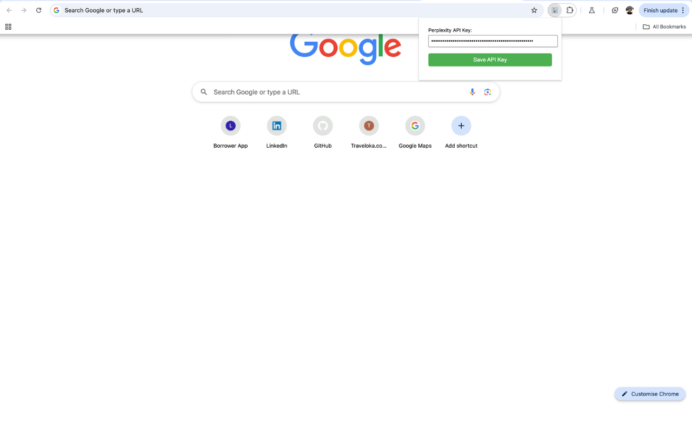

# PurrSpective

A delightful Chrome extension that helps users evaluate webpage credibility and trustworthiness with the help of AI and cats! 😺

## Features

- Real-time content analysis
- Credibility scoring
- Trust assessment
- Fact checking
- Related trustworthy sources
- Cute cat-themed interface

## Screenshots

<details>
<summary>Click to see screenshots</summary>

### Main Interface

*The main sidebar interface showing credibility scores and analysis*

### Fact Checking

*Detailed fact-checking analysis with trust indicators*

### Analysis View

*In-depth content analysis and trust assessment*

### More





</details>

## Installation

### From Chrome Web Store (Coming Soon)
> ⚠️ The extension is currently under review by the Chrome Web Store team. In the meantime, please use the manual installation method below.

Once approved, you'll be able to:
1. Visit the Chrome Web Store
2. Search for "PurrSpective"
3. Click "Add to Chrome"

### Manual Installation

#### Latest Release
Download the latest version from our [Releases Page](https://github.com/empeje/purr-spective/releases/latest)

#### Chrome
1. Download `purrspective-vX.X.X.zip` from the latest release
2. Unzip the file
3. Open Chrome and go to `chrome://extensions/`
4. Enable "Developer mode" in the top right
5. Click "Load unpacked"
6. Select the unzipped folder
7. The extension icon should appear in your toolbar

#### Firefox
1. Download `purrspective-vX.X.X.zip` from the latest release
2. Unzip the file
3. Open Firefox and go to `about:debugging#/runtime/this-firefox`
4. Click "Load Temporary Add-on"
5. Navigate to the unzipped folder and select `manifest.json`
6. The extension icon should appear in your toolbar

Note: In Firefox, the extension will need to be reloaded after browser restart due to temporary installation limitations.

## Usage

1. Click the PurrSpective cat icon in your toolbar
2. Enter your Perplexity API key
3. Browse any webpage and click the cat icon to analyze

## Development

For developers who want to contribute or modify the extension:

1. Clone the repository
```bash
git clone https://github.com/empeje/purr-spective.git
cd purr-spective
```

2. Download the development build (`purrspective-dev.zip`) from our [Releases Page](https://github.com/empeje/purr-spective/releases/latest)

3. Build from source
```bash
make dev    # Creates development build
make build  # Creates production build
```

## Privacy

- No user data is collected or stored
- API keys are stored locally
- All analysis is performed through secure API calls

## Support

For support or feature requests, please open an issue on our GitHub repository.

## License

MIT License - See LICENSE file for details

## Verification

To verify the downloaded release:
```bash
sha256sum -c purrspective-vX.X.X.sha256
``` 